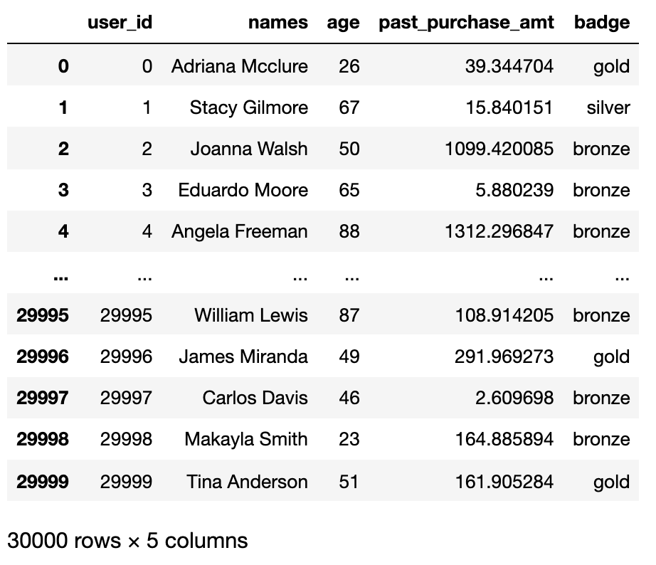
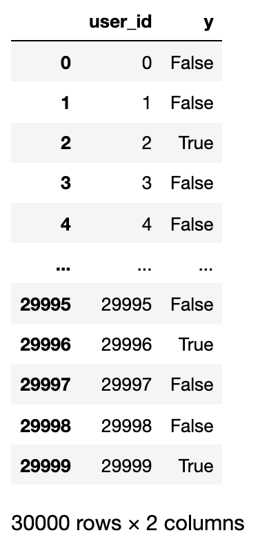
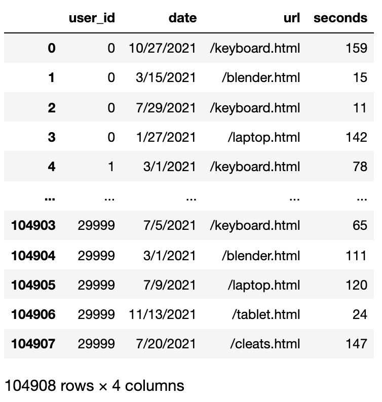

# Smart Marketing Laptop Prediction Model

## Overview

This model  aims to leverage customer data to predict interest in a promotional email campaign for laptops.
By analyzing user interactions and previous email engagement, the classifier discerns potential customers to target, 
enhancing marketing efficiency and customer satisfaction.

## Features

* Data-Driven Predictive Modeling: Utilizes machine learning to analyze user behavior and predict email engagement.
* Custom UserPredictor Class: Houses the predictive model, providing fit and predict methods for easy use with new data.
* Intelligent Feature Engineering: Incorporates user data and web log interactions to create a robust feature set for the model.

## Classifier Development

* Preprocessing: Implements column addition for user-specific statistics from log data, such as total website engagement time and interest in laptop-related content.
* Model Pipeline: Combines preprocessing steps with a Logistic Regression classifier, including imputation and scaling for numerical features and one-hot encoding for categorical features.
* Accuracy Optimization: Achieved 79% accuracy, with cross-validation techniques to ensure model robustness.

## Dataset

There are 3 generated datasets:

1. train
2. test1
3. test2 (secret)

The classifier fits to the training data, then estimate the
accuracy using the test1 data.  

Each of the 3 datasets consist of 3 files:

1. `???_users.csv`: information about each user
2. `???_logs.csv`: details about webpages visited by each user
3. `???_y.csv`: y=1 means they clicked the email; y=0 means they did not

Here is some data in `train_users.csv`:

Here is the corresponding data from `train_y.csv`:

After matching the IDs and considering the `y` column, we can see
Adriana (user_id 0) did not click the ad (y=False).

Here is some data in `train_logs.csv`:

Each row represents a visit to a webpage on the site.  Each row
contains the date, the id of the user who visited the page, the url
that they visited, and the number of minutes spent on the page.  We
see Adriana visited 4 pages on the website for varying amounts of time
(including one for laptop.html).

## Setup & Execution
* Collect user and log data, ensuring it's formatted according to the provided schema.
* Install the required Python libraries, including pandas, scikit-learn, and numpy.
* Execute tester.py with main.py to validate model performance against test1 data.
